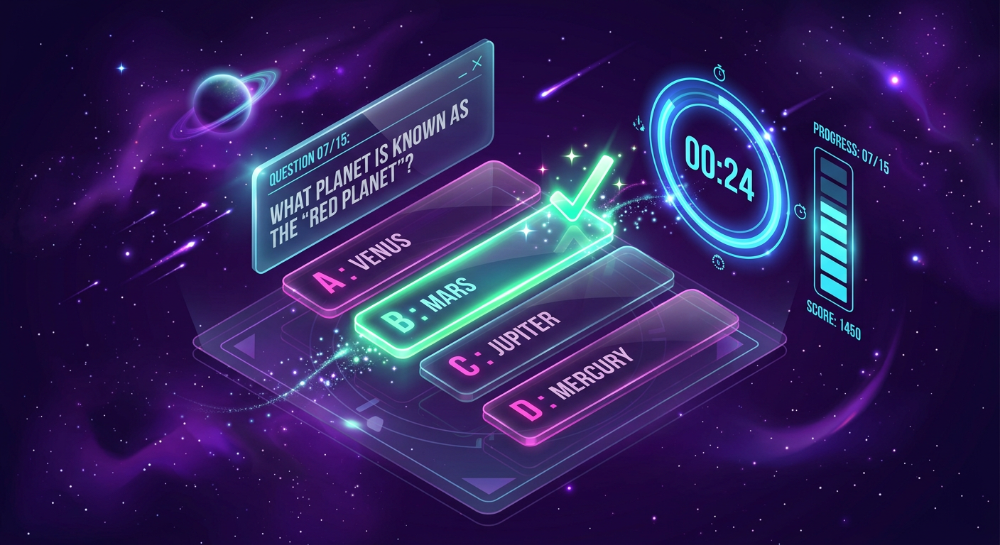

# QuizVerse 🎯

A modern, full-stack AI-powered online quiz platform built with **React + TypeScript + Vite + Tailwind CSS + Supabase + OpenRouter**.



## ✨ Features

### For Students
- 📝 Browse and take quizzes across multiple categories
- ⏱️ Timer-based quizzes with auto-submit
- 📊 Real-time performance analytics with charts
- 🏆 Global and quiz-specific leaderboards
- 📜 PDF certificate generation for top scores
- 🤖 AI-powered quiz generation with OpenRouter
- 🌓 Dark/Light mode toggle

### For Admins
- 📊 Admin dashboard with analytics
- 📝 Create, edit, delete quizzes
- 👥 User management
- 📈 View all attempts and statistics
- 🔐 Role-based access control

## 🛠️ Tech Stack

- **Frontend:** React 18, TypeScript, Vite, Tailwind CSS
- **State Management:** React Context API
- **Charts:** Recharts
- **Icons:** Lucide React
- **Backend:** Supabase (Auth + Database)
- **AI:** OpenRouter API (Meta Llama, GPT, etc.)

## 🚀 Quick Start

### 1. Clone the Repository

```bash
git clone https://github.com/yourusername/quizverse.git
cd quizverse
```

### 2. Install Dependencies

```bash
npm install
```

### 3. Setup Environment Variables

Create a `.env` file from the example:

```bash
cp .env.example .env
```

Fill in your credentials:

```env
# Supabase (Required)
VITE_SUPABASE_URL=https://your-project-ref.supabase.co
VITE_SUPABASE_PUBLISHABLE_KEY=your-supabase-publishable-key

# OpenRouter (For AI features)
VITE_OPENROUTER_API_KEY=sk-or-v1-your-openrouter-key
VITE_OPENROUTER_MODEL=meta-llama/llama-3.3-70b-instruct:free
```

### 4. Setup Supabase Database

1. Go to [Supabase Dashboard](https://supabase.com/dashboard)
2. Create a new project
3. Open **SQL Editor**
4. Run the migration file: `supabase/migrations/20260101000000_quizverse_schema.sql`

### 5. Setup OpenRouter (Optional - for AI quiz generation)

1. Go to [OpenRouter](https://openrouter.ai/) and create an API key
2. Add it to your `.env` file

### 6. Run the App

```bash
npm run dev
```

Open [http://localhost:5173](http://localhost:5173) in your browser.

## 👥 Default Credentials

When running **without Supabase** (local mode):

- **Admin:** `admin@quizverse.com` / `admin123`
- **Student:** `student@quizverse.com` / `student123`

When running **with Supabase**:
1. Register a new account
2. Go to Supabase Table Editor → profiles
3. Change your user's `role` from `student` to `admin`
4. Logout and login again

## 📁 Project Structure

```
quizverse/
├── src/
│   ├── components/       # Reusable UI components
│   ├── contexts/         # Auth, Theme, Data contexts
│   ├── pages/            # Page components
│   ├── lib/              # Supabase & OpenRouter clients
│   ├── data/             # Seed quizzes data
│   ├── utils/            # Helper utilities
│   ├── types.ts          # TypeScript types
│   ├── App.tsx           # Main app with routing
│   └── main.tsx          # Entry point
├── supabase/
│   ├── migrations/       # Database schema
│   └── functions/        # Edge functions (AI)
├── public/               # Static assets
├── .env.example          # Environment template
├── .gitignore            # Git ignore rules
└── README.md             # This file
```

## 🗄️ Database Schema

### Tables

- **profiles** - User profiles with roles (student/admin)
- **quizzes** - Quiz metadata and questions (JSONB)
- **quiz_attempts** - User quiz submissions
- **leaderboards** - Ranking data

### Features

- ✅ Row Level Security (RLS) enabled
- ✅ Automatic profile creation on signup
- ✅ Admin role helper function
- ✅ Indexes for performance

## 🚀 Deployment

### Deploy Frontend (Vercel/Netlify)

```bash
npm run build
```

Upload the `dist/` folder to your hosting platform.

**Important:** Set environment variables in your hosting dashboard:
- `VITE_SUPABASE_URL`
- `VITE_SUPABASE_PUBLISHABLE_KEY`

### Deploy Supabase Edge Function (Production)

```bash
# Deploy the AI generation function
supabase functions deploy generate-quiz

# Set secrets (OpenRouter key should be secret, not in .env)
supabase secrets set OPENROUTER_API_KEY=sk-or-v1-your-openrouter-key
supabase secrets set OPENROUTER_MODEL=meta-llama/llama-3.3-70b-instruct:free
```

## 🎯 Environment Variables

| Variable | Description | Required |
|----------|-------------|----------|
| `VITE_SUPABASE_URL` | Your Supabase project URL | ✅ Yes |
| `VITE_SUPABASE_PUBLISHABLE_KEY` | Supabase publishable/anonymous key | ✅ Yes |
| `VITE_OPENROUTER_API_KEY` | OpenRouter API key (for local dev) | ⚠️ Recommended |
| `VITE_OPENROUTER_MODEL` | AI model to use | ❌ Optional |

## 🛡️ Security Notes

- ✅ `VITE_OPENROUTER_API_KEY` is exposed to browser (acceptable for local dev)
- ✅ For production, use Supabase Edge Function secrets instead
- ✅ RLS policies protect all database tables
- ✅ Only admins can manage quizzes and view all data
- ✅ Users can only see their own attempts

## 🐛 Troubleshooting

### Can't login after registering?
- Check Supabase Auth settings: Disable "Confirm email" for development
- Check browser console for errors
- Verify your Supabase URL and key are correct

### Admin dashboard not showing?
- Update your role to `admin` in Supabase profiles table
- Logout and login again

### AI generation not working?
- Check `VITE_OPENROUTER_API_KEY` is set
- Try the Supabase Edge Function for production
- Check browser console for API errors

## 📝 License

MIT License - feel free to use for personal or commercial projects!

## 🙏 Credits

- Built with ❤️ using React, TypeScript, and Tailwind CSS
- Icons by [Lucide](https://lucide.dev/)
- Charts by [Recharts](https://recharts.org/)
- AI by [OpenRouter](https://openrouter.ai/)
- Backend by [Supabase](https://supabase.com/)

---

**Happy Quizzing! 🎓✨**
